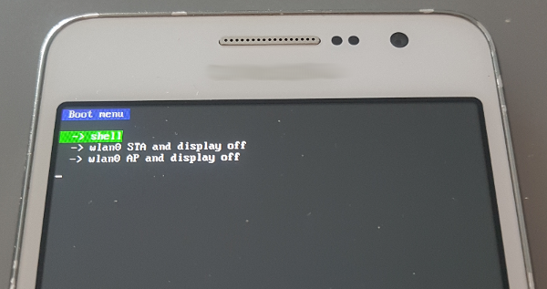
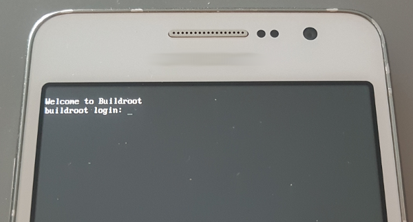
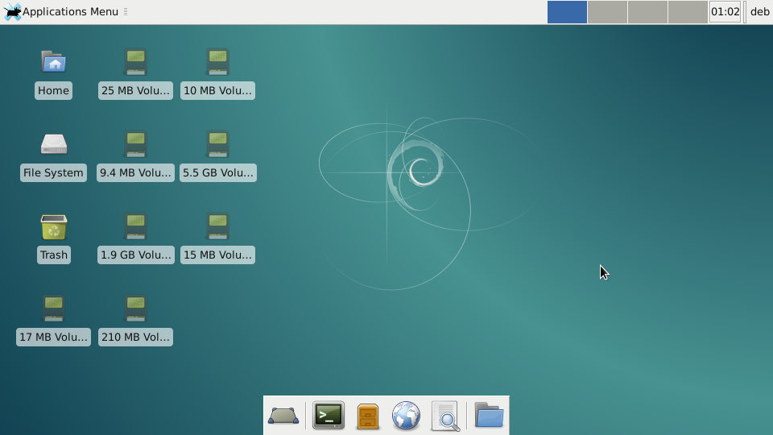
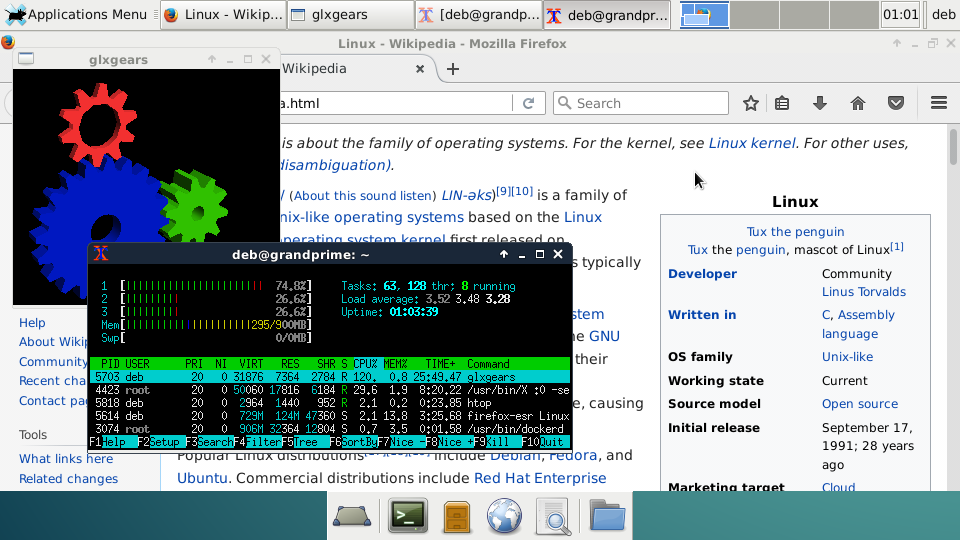
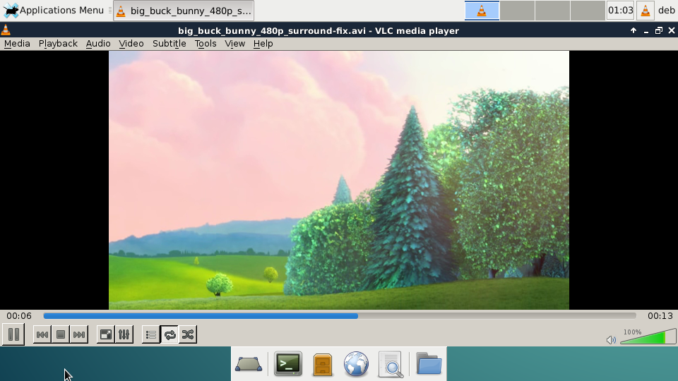
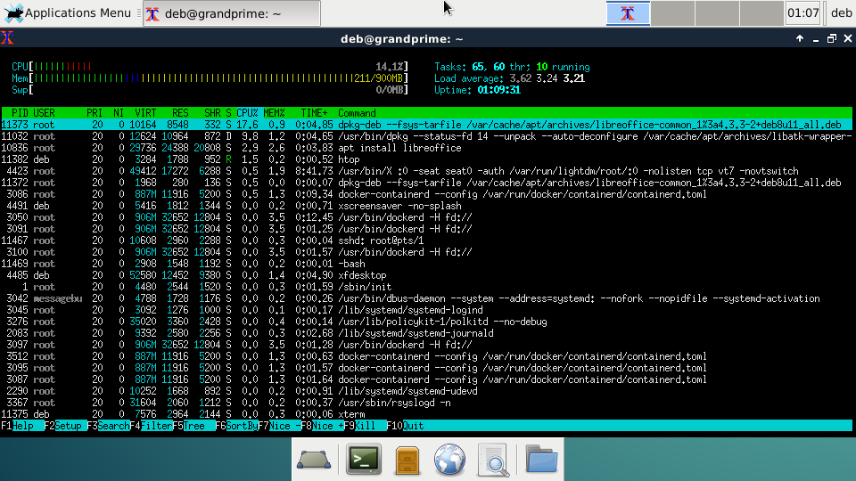
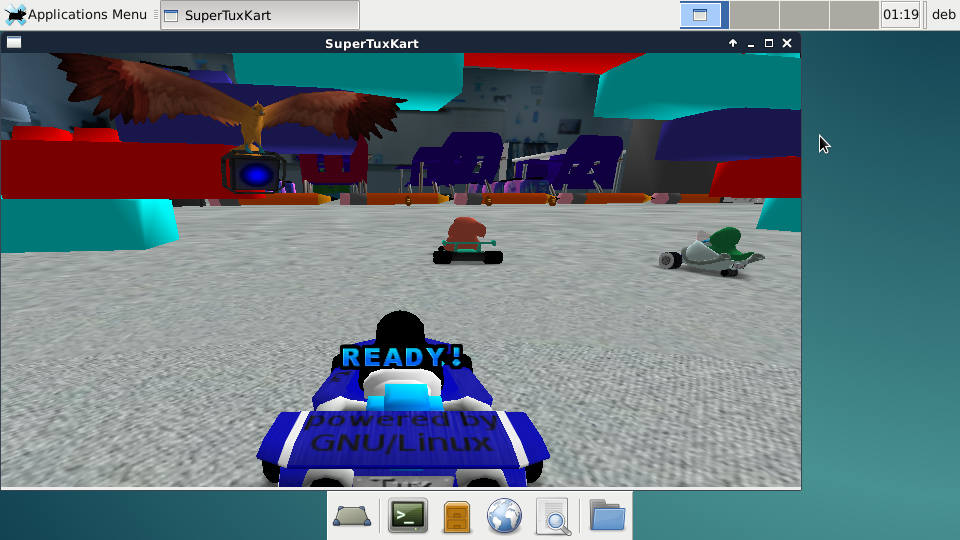
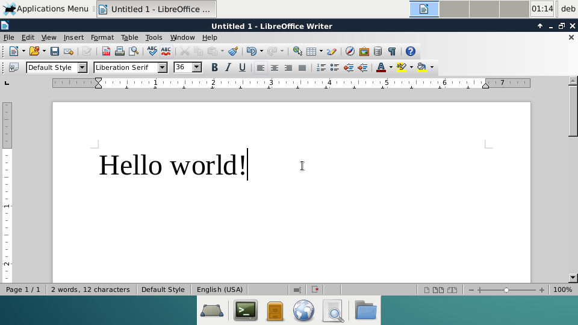
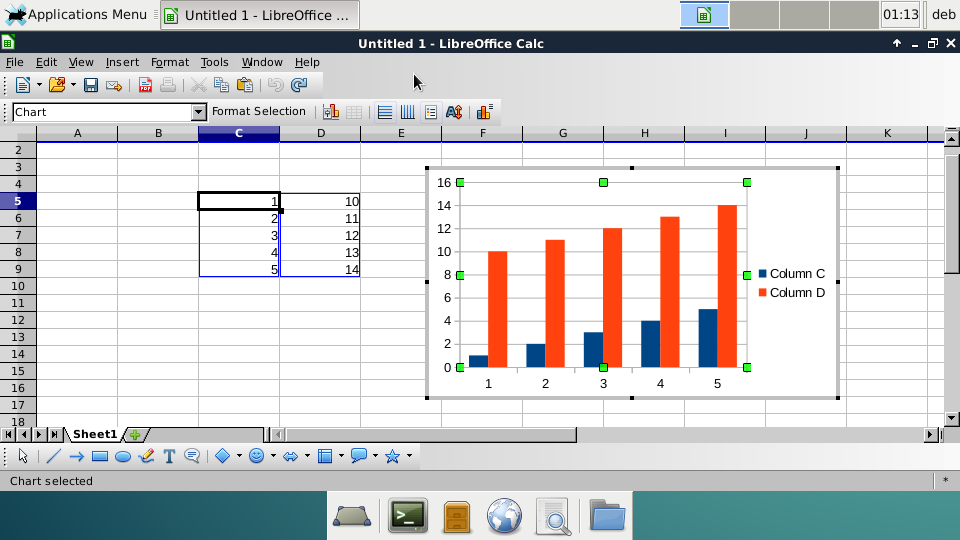

# Linux in the pocket

This project brings bare-metal Linux desktop and services to smartphones.

Plenty of smartphones are sadly lying around, waiting for a second life. Most of them provide enough resources to be recycled as mini computers. With a variety of sensors, cameras, microphones, they are great battery-powered maker devices. As smartphones often support USB OTG, even more peripherals to be added for desktop use.


This is only possible with software that allows customization. This repository shows how to build such a system using existing free and open-source software. Only because I had a spare one, I am using [this model](https://www.samsung.com/levant/smartphones/galaxy-grand-prime-g531h/) as reference. Similar work is possible with other smartphones and other embedded devices.

# Before starting

## Warning

Following these instructions is very fun and teaches a lot, but it is also likely to render a smartphone unusable. Use at your own risk!

## Recovery image

Many unlocked smartphones can be flashed with alternative recovery systems such as [TWRP](https://twrp.me/). Thanks to such projects, some public repositories point to the exact software components that run on each supported device. Those components are assembled in a recovery image that is flashed to the recovery partition. It contains at least a compressed Linux kernel, a RAM disk and a device tree blob (DTB). Here we will build a generic Linux recovery image that can be used for various use cases and not only as a recovery system.

## Buildroot

[Buildroot](https://www.buildroot.org/) is a great tool for creating such a recovery image. With the correct configuration, it will build a toolchain and other tools for the host, a Linux kernel and a root file system for our target.

In this particular case, the kernel depends on a specialized class of compiler. This compiler is not suited to build the user space components of the root file system. For this task we will rely on the compiler built by Buildroot. This means there are 2 toolchains at play to build our system.

The *Makefile* should execute all tasks that will lead to the creation of the recovery image, from downloading the sources to configuring the components to compiling and assembling the image.

# Build your system

## Recovery image with RAM disk as root file system

This recovery image is sufficient to run a minimal system. The user space components come from a RAM disk bundled in the image. It is limited to a few megabytes in size.

### Build

```
$ make recovery_ramfs
```

The recovery image to flash is created under *output/ramfs/recovery.img.tar*.

### Flash

On the smartphone used as reference, this file can be flashed with Odin (tested with 3.12.3). In AP, select the *output/ramfs/recovery.img.tar* file then click *Start*.

### Boot menu

For demonstration, a boot menu appears when the system starts. It is a simple interactive [micropython](https://micropython.org/) script that can be controlled with the volume and the home keys. The following options are available by default:
* shell: continue standard Buildroot boot to login
* wlan0 STA and display off: turn off the display to save energy, connect Wi-Fi in station mode according to *src/overlay/ramfs/etc/wpa_supplicant.conf*
* wlan0 AP and display off: : turn off the display to save energy, start Wi-Fi in access point mode according to *src/overlay/ramfs/etc/hostapd/hostapd.conf*

### Connect via SSH over USB

The [Dropbear](https://matt.ucc.asn.au/dropbear/dropbear.html) SSH server is started, the USB ethernet interface on the target statically takes the IP *192.168.234.2*. By setting the host USB ethernet interface to IP *192.168.234.1*, a connection to the target can be established with:
```
$ ssh root@192.168.234.2
```
Default password is *root*.

### Customization

#### Firmware

Some binary firmware files might be expected by the device specific kernel drivers. If so, they must be extracted from the original system or a backup image and copied to *src/overlay/ramfs/lib/firmware/*. With the smartphone used as reference, those files are:
* mrvl/bt_init_cfg.conf
* mrvl/SDIO8777_SDIO_SDIO.bin
* mrvl/txpwrlimit_cfg.bin
* mrvl/sd8777_uapsta.bin
* mrvl/WlanCalData_ext.conf
* mrvl/bt_cal_data.conf
* mrvl/txbackoff.txt
* mrvl/txpower_FC.bin
* mrvl/reg_alpha2
* ispfw_v325.bin

#### USB ethernet

The system is configured to bring up the *rndis0* network interface (USB ethernet) is connected to a USB host at boot time. The IP configuration can be changed in *src/overlay/ramfs/etc/network/interfaces*.

#### Wi-Fi

The SSID and PSK can be added before building in *src/overlay/ramfs/etc/wpa_supplicant.conf*. Some scripts will bring up the interface if started with:

```
$ ifup wlan0
```

Alternatively, *src/overlay/ramfs/etc/network/interfaces* can be edited so that the interface is brought up at startup by uncommenting *auto wlan0*.

### Screenshots

RAM disk boot menu



RAM disk shell with Buildroot



## Recovery image with file system on SD card

Here the recovery image boots the device but the root file system is located on the SD card, which gives much more flexibility.

### Build

```
$ make recovery_sdcard
```

The recovery image to flash is created under *output/sdcard/recovery.img.tar*.

### Flash

On the smartphone used as reference, this file can be flashed with Odin (tested with 3.12.3). In AP, select the *output/sdcard/recovery.img.tar* file then click *Start*.

### Create Debian SD card

[Debootstrap](https://wiki.debian.org/Debootstrap) makes it super easy to populate a root file system for an architecture supported by [Debian](https://www.debian.org/):

```
$ make rootfs_sdcard
```

An archive of the root file system is created under *output/sdcard/rootfs.tar.gz*, ready to be extracted at the root of the SD card.

### Screenshots

Xfce4 desktop



Multitask



VLC



htop



SuperTuxKart



LibreOffice Writer



LibreOffice Calc



# External references

## TWRP

To build TWRP for the smartphone used as reference, the following Docker container can be used:

```
FROM debian:9
RUN apt update
RUN apt install -y git make schedtool python3 imagemagick curl openjdk-8-jdk unzip nano python bc bison flex zip git make schedtool python3 imagemagick curl openjdk-8-jdk libc6-dev-i386 build-essential g++-multilib
RUN git config --global user.name "Your Name"
RUN git config --global user.email "you@example.com"
RUN curl https://storage.googleapis.com/git-repo-downloads/repo > /usr/bin/repo
RUN sed -i "s/\#\!\/usr\/bin\/env\spython/\#\!\/usr\/bin\/python3/" /usr/bin/repo
RUN sed -i "s/MIN_PYTHON_VERSION\s=\s(3,\s6)/MIN_PYTHON_VERSION = (3, 5)/" /usr/bin/repo
RUN chmod +x /usr/bin/repo
```

From within the container:

```
$ repo init -u git://github.com/minimal-manifest-twrp/platform_manifest_twrp_omni.git -b twrp-5.1
```

In *.repo/manifest.xml* add:

```
<project path="device/samsung/grandprimevelte" name="TeamWin/android_device_samsung_grandprimevelte" remote="github" revision="android-5.1" />
```

Then run:

```
$ repo sync
$ . build/envsetup.sh
```

Comment *device/common/gps/gps_us_supl.mk* in *device/samsung/grandprimevelte/device.mk*.

Comment *$(error stopping)* in *bootable/recovery/minuitwrp/Android.mk* after *TW_BOARD_CUSTOM_GRAPHICS support has been deprecated in TWRP*

Finally build with:

```
$ lunch omni_grandprimevelte-eng
$ mka recoveryimage ALLOW_MISSING_DEPENDENCIES=true
```

## Links

* https://github.com/diepquynh/android_kernel_samsung_grandprimeve3g
* https://github.com/Shubzz-02/Samsung_grandprimevelte_Kernel
* https://github.com/TeamWin/android_device_samsung_grandprimevelte
