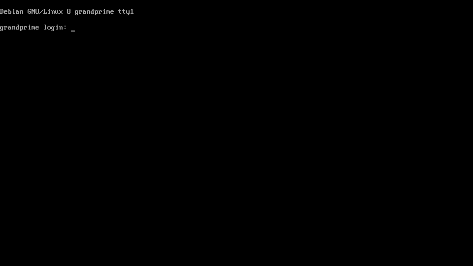

# Linux in the pocket

This project brings bare-metal Linux desktop and services to smartphones.

Plenty of smartphones are sadly lying around, waiting for a second life. Most of them provide enough resources to be recycled as mini computers. With a variety of sensors, cameras, microphones, they are great battery-powered maker devices. As smartphones often support USB OTG, even more peripherals to be added for desktop use. This is only possible with software that allows customization. This repository shows how to build such a system using existing free and open-source software on [supported hardware](doc/Supported_hardware.md). See the [gallery](doc/Gallery.md) for applications.


# Run Debian on your smartphone

## Build the system from scratch

The Makefile in this repository will take care of the whole build process, from fetching the source to compiling and assembling the system images. Let's start by getting the required files:

```
$ git clone https://github.com/fdu/lip.git
$ cd lip
```

The build process can run natively or from within a Docker container. This is optional but solves the build environment issues. Afterwards, the build instructions themselves are identical. If you wish to build from a Docker container, run:

```
$ docker build -t lip-builder src/docker/lip-builder/
$ docker run -it --rm -v `pwd`:`pwd` lip-builder sh -c "cd `pwd` && bash"
```

Now we are ready to build the system images:

```
$ make
```

Once the build completes, the images are available under *output/*. The [recovery image](doc/Recovery_and_Buildroot.md) *output/sdcard/recovery.img.tar* contains the Linux kernel and device tree blobs. It must be flashed with Odin (tested on the smartphone used as reference with version 3.12.3). In AP, select the *output/sdcard/recovery.img.tar* file then click *Start*.

An archive of the root file system has been created under *output/sdcard/rootfs.tar.gz* with [debootstrap](https://wiki.debian.org/Debootstrap). It contains a base Debian system with a SSH server and minimal device specific configuration. The archive must be extracted at the root of an ext4 formatted SD card.

Insert the SD card into the smartphone, reboot in recovery mode. The following login prompt should be visible:



Congratulations, this is Debian running on your smartphone!

# More pages

* [Gallery](doc/Gallery.md)
* [Supported hardware](doc/Supported_hardware.md)
* [Recovery image and Buildroot](doc/Recovery_and_Buildroot.md)
* [Build a RAM-disk only system with Buildroot](doc/Recovery_image_Buildroot_RAM_disk.md)
* [Build TWRP](doc/Build_TWRP.md)
