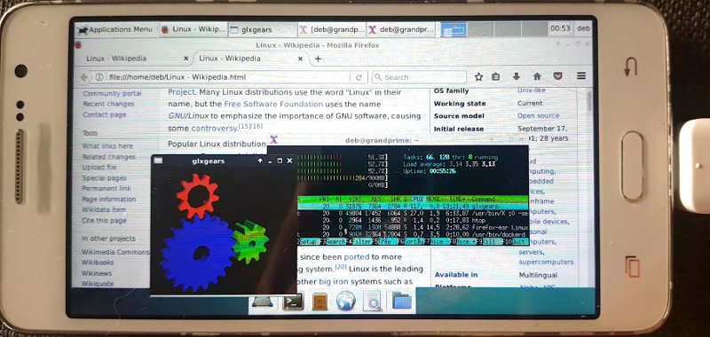
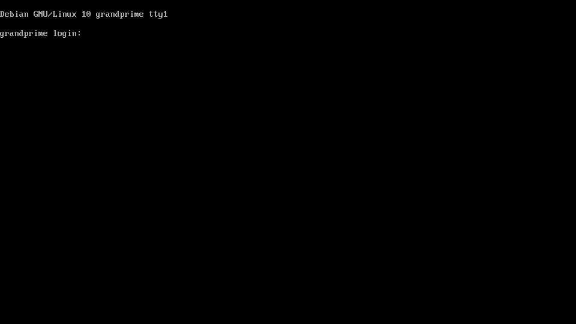
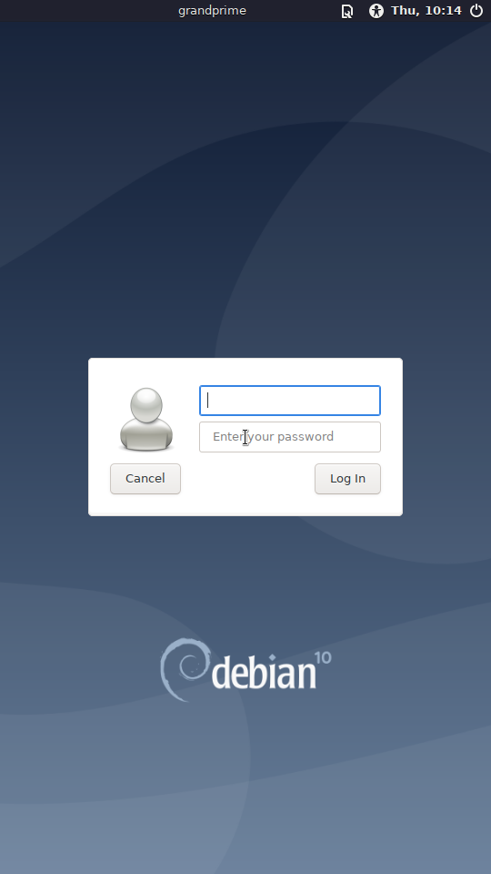
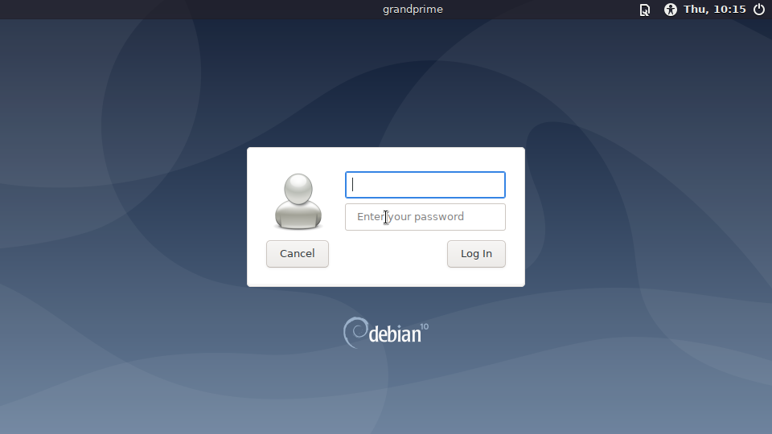
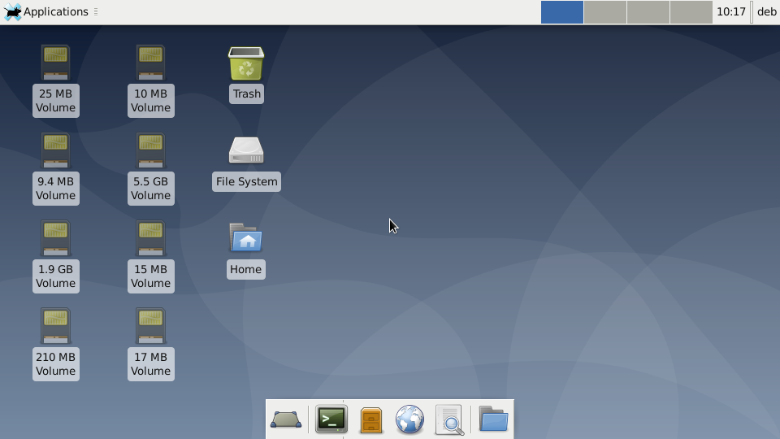
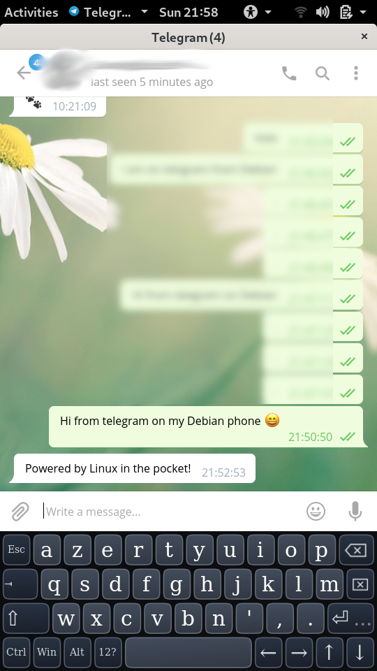

# Linux in the pocket

This project brings bare-metal Linux desktop and services to smartphones.

Plenty of smartphones are sadly lying around, waiting for a second life. Most of them provide enough resources to be recycled as mini computers. With a variety of sensors, cameras, microphones, they are great battery-powered maker devices. As smartphones often support USB OTG, even more peripherals to be added for desktop use. This is only possible with software that allows customization. This repository shows how to build such a system using existing free and open-source software on [supported hardware](doc/Supported_hardware.md). See the [gallery](doc/Gallery.md) for applications.



# Run Debian on your smartphone!

## Build images

The Makefile in this repository will take care of the whole build process, from fetching the source to compiling and assembling the system images. Let's start by getting the required files:

```
$ git clone https://github.com/fdu/lip.git
$ cd lip
```

The build process can run natively or from within a Docker container. This is optional but solves the build environment issues. Afterwards, the build instructions themselves are identical. If you wish to build from a Docker container, run:

```
$ docker build -t lip-builder src/docker/lip-builder/
$ docker run -it --rm -v `pwd`:`pwd` lip-builder sh -c "cd `pwd` && bash"
```

Now we are ready to build the system images:

```
$ make
```

Once the build completes, the images are available under *output/*. The [recovery image](doc/Recovery_and_Buildroot.md) *output/sdcard/recovery.img.tar* contains the Linux kernel and device tree blobs. It must be flashed with Odin (tested on the smartphone used as reference with version 3.12.3). In AP, select the *output/sdcard/recovery.img.tar* file then click *Start*.

An archive of the root file system has been created under *output/sdcard/rootfs.tar.gz* with [debootstrap](https://wiki.debian.org/Debootstrap). It contains a base Debian system with a SSH server and minimal device specific configuration. The archive must be extracted at the root of an ext4 formatted SD card.

Insert the SD card into the smartphone, reboot in recovery mode. The following login prompt should be visible:



Congratulations, this is Debian running on your smartphone!

## Configure

### Use the console and SSH

With [USB OTG](https://en.wikipedia.org/wiki/USB_On-The-Go) enabled, an USB keyboard can be connected to interact with the login prompt. This implies editing the */etc/shadow* file on the SD card from another machine beforehand, in order to set the root password.

Alternatively, this minimal Debian system run a SSH server. If connected to a USB host, a USB ethernet network adapter is brought up at boot with IP 192.168.234.2. By setting IP 192.168.234.1 on the host, the Debian smartphone answers to ping. Before connecting over SSH, either a user and password must be added in the SD card from another machine, or the public SSH key of the host must be copied to */root/.ssh/authorized_keys*.

```
$ ssh root@192.168.234.2

The programs included with the Debian GNU/Linux system are free software;
the exact distribution terms for each program are described in the
individual files in /usr/share/doc/*/copyright.

Debian GNU/Linux comes with ABSOLUTELY NO WARRANTY, to the extent
permitted by applicable law.
root@grandprime:~#
```

Welcome to Debian on your phone!

By enabling IP forwarding and masquerading on the host, the phone can connect to internet, which will be needed to install more packages.

### Give user permissions

The Android kernel with *CONFIG_ANDROID_PARANOID_NETWORK* requires users to be added to groups with predefined GIDs in order to access network. First let's create those groups:

```
$ groupadd -g 3001 aid_bt
$ groupadd -g 3002 aid_bt_net
$ groupadd -g 3003 aid_inet
$ groupadd -g 3004 aid_net_raw
$ groupadd -g 3005 aid_admin
```

Then add *root* to those groups:

```
$ usermod -aG aid_bt,aid_bt_net,aid_inet,aid_net_raw,aid_admin root
```

A normal user is added with:

```
$ adduser deb 
Adding user `deb' ...
Adding new group `deb' (1001) ...
Adding new user `deb' (1001) with group `deb' ...
Creating home directory `/home/deb' ...
Copying files from `/etc/skel' ...
Enter new UNIX password: 
...
```

Just like for *root*, this user needs to be added to the network permission groups:

```
$ usermod -aG aid_bt,aid_bt_net,aid_inet,aid_net_raw,aid_admin deb
```

### Install packages

To install packages with *apt*, the user *_apt* needs some of the network permissions:

```
$ usermod -G nogroup -g aid_inet _apt
```

The system is now ready to install more software packages through network. For example to install *sudo*:

```
$ apt update
Hit:1 http://deb.debian.org/debian buster InRelease
Reading package lists... Done
Building dependency tree... Done
All packages are up to date.
$ apt install sudo
...
```

Finally, to allow *sudo* without password:

```
$ echo "%sudo ALL=(ALL) NOPASSWD: ALL" >> /etc/sudoers
```

### Wi-Fi

Wi-Fi requires binary firmware files. They must be extracted over from an original system or a backup and copied to *src/overlay/sdcard/lib/firmware/*. With the smartphone used as reference, those files are:
* mrvl/bt_init_cfg.conf
* mrvl/SDIO8777_SDIO_SDIO.bin
* mrvl/txpwrlimit_cfg.bin
* mrvl/sd8777_uapsta.bin
* mrvl/WlanCalData_ext.conf
* mrvl/bt_cal_data.conf
* mrvl/txbackoff.txt
* mrvl/txpower_FC.bin
* mrvl/reg_alpha2
* ispfw_v325.bin

To use Wi-Fi in sation mode from the command line, add *wpa-ssid* and *wpa-psk* to */etc/network/interfaces* for your network with the interface *wlan0*. Then to bring it up with:

```
$ ifup wlan0
```

## Docker

The complete instructions to install [Docker](https://www.docker.com/) on Debian are [here](https://docs.docker.com/engine/install/debian/). In our case it is:

```
$ apt install apt-transport-https curl gnupg
$ curl -kfsSL https://download.docker.com/linux/debian/gpg | apt-key add -
```

Then in */etc/apt/sources.list* add:

```
deb [arch=armhf] https://download.docker.com/linux/debian buster stable

```

As overlay is not available, [VFS](https://docs.docker.com/storage/storagedriver/vfs-driver/) can be use for storage. Create the file */etc/docker/daemon.json* with:

```
{
  "storage-driver": "vfs"
}
```

To install Docker:

```
$ apt update
$ apt install docker-ce
```

Docker will not start unless iptables is set to legacy mode (select 1 in the menu):

```
$ update-alternatives --config iptables
```

Now let's restart it and check it is working:

```
$ systemctl restart docker
$ docker ps
CONTAINER ID        IMAGE               COMMAND             CREATED             STATUS              PORTS               NAMES
$ docker run -it --rm hello-world
Unable to find image 'hello-world:latest' locally
latest: Pulling from library/hello-world
4ee5c797bcd7: Pull complete 
Digest: sha256:8e3114318a995a1ee497790535e7b88365222a21771ae7e53687ad76563e8e76
Status: Downloaded newer image for hello-world:latest

Hello from Docker!
...

$ docker run -it --rm busybox
Unable to find image 'busybox:latest' locally
latest: Pulling from library/busybox
47a9f0637952: Pull complete 
Digest: sha256:a8cf7ff6367c2afa2a90acd081b484cbded349a7076e7bdf37a05279f276bc12
Status: Downloaded newer image for busybox:latest
/ # busybox 
BusyBox v1.31.1 (2020-04-13 23:06:12 UTC) multi-call binary.
...
```

## Xfce4 desktop

[Xorg](https://www.x.org) comes with a frame buffer driver which is a sufficient fall back solution to run the lightweight desktop environment [Xfce](https://xfce.org/). Let's start by installing it:

```
$ apt install xfce4 lightdm
```

Stride / pitch issues can be fixed with fbset:

```
$ fbset -xres 536 -yres 960
```

To execute it whenever LightDM starts, add it to */lib/systemd/system/lightdm.service*:

```
...
ExecStart=/usr/sbin/lightdm
ExecStartPost=/bin/fbset -xres 536 -yres 960
Restart=always
...
```

The LightDM login screen appears and the pointer can be controller with the touchscreen:



To switch to landscape orientation, create the file */etc/X11/xorg.conf* with:

```
Section "Device"  
  Identifier "fb"
  Driver "fbdev"
  Option "fbdev" "/dev/fb0"
  Option "Rotate" "CW"
EndSection
```



To auto-login and start directly to the Xfce desktop, set the following in */etc/lightdm/lightdm.conf*:

```
[SeatDefaults]
autologin-user=deb
...
```



## Gnome desktop

```
$ apt install gnome-core
```

*/usr/lib/systemd/system/gdm3.service*

```
...
[Service]
ExecStartPre=/usr/share/gdm/generate-config
ExecStart=/usr/sbin/gdm3
ExecStartPost=/bin/fbset -xres 536 -yres 960
...
```

```
$ fbset -xres 536 -yres 960 -rgba 8/16,8/8,8/0,8/24
```

## Telegram

The following will install the [Telegram](https://telegram.org/) desktop client and [Florence](http://florence.sourceforge.net/english/index.html) as virtual keyboard to type messages with the touchscreen:

```
$ apt install florence telegram-desktop
```



# More pages

* [Gallery](doc/Gallery.md)
* [Supported hardware](doc/Supported_hardware.md)
* [Recovery image and Buildroot](doc/Recovery_and_Buildroot.md)
* [Build a RAM-disk only system with Buildroot](doc/Recovery_image_Buildroot_RAM_disk.md)
* [Build TWRP](doc/Build_TWRP.md)
