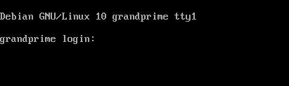
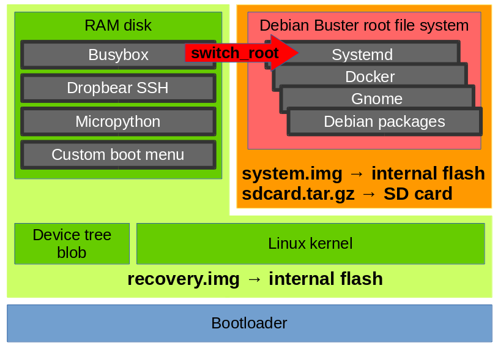

# Linux in the pocket

Run [Debian Buster](https://www.debian.org/releases/buster/) on your smartphone!

This project provides a set of configuration files to build from scratch a complete Linux system for a smartphone, turning it into a mini battery-powered [single board computer](https://en.wikipedia.org/wiki/Single-board_computer) with plenty of sensors. Thanks to its display and [USB OTG](https://en.wikipedia.org/wiki/USB_On-The-Go), it can be used as a fully functional and customizable portable Debian system.


# Quick start

## Build the images

The system images are built from the files in this repository. The first step is to get a copy of them:

```
$ git clone https://github.com/fdu/lip.git
$ cd lip
```

The build process can run natively or from within a Docker container. This is optional but ensures the build environment is functional. To build the container images and instanciate it for the build:

```
$ docker build -t lip-builder src/docker/lip-builder/
$ docker run -it --rm -v `pwd`:`pwd` --privileged lip-builder sh -c "cd `pwd` && bash"
```

The Makefile will fetch the required sources, compile the components and assemble the images:

```
$ make
```

The images are created under *output/*.

## Flash the images

This requires erasing the recovery and system partitions of the device. When using the device listed in [supported hardware](doc/Supported_hardware.md), the easiest way to flash the system is by restarting in recovery mode hold power, home and volume down then run:

```
$ make flash
```

Alternatively, the content of *output/sdcard/rootfs.tar.gz* can be extracted to an ext4 partition of the internal flash or to a SD card.

## Run the images

To boot the device in recovery mode, hold power, home and volume up. The Linux kernel boots, the RAM disk is loaded and shows a boot menu. Use the volume keys for entry selection, home to confirm.

* *Shell* drop to a shell immediately
* *RAM disk (Busybox init)* hand over to Busybox system initialization provided in the RAM disk
* *Internal eMMC partition (SYSTEM)* hand over to Debian by running Busybox *switch_root* to */sbin/init* on the system partition

When Debian is booted, the following prompt appears:



Congratulations, Debian is running on your phone!

This is only the beginning, see all what is now possible in the next section.

## System configuration

See how to configure the system in [system configuration](doc/System_configuration.md).

# Block diagram



# Gallery

