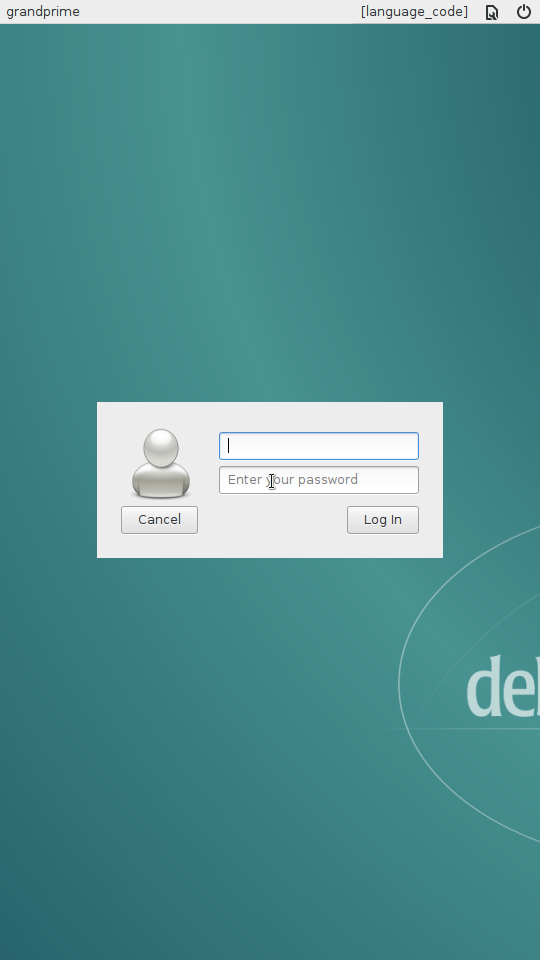
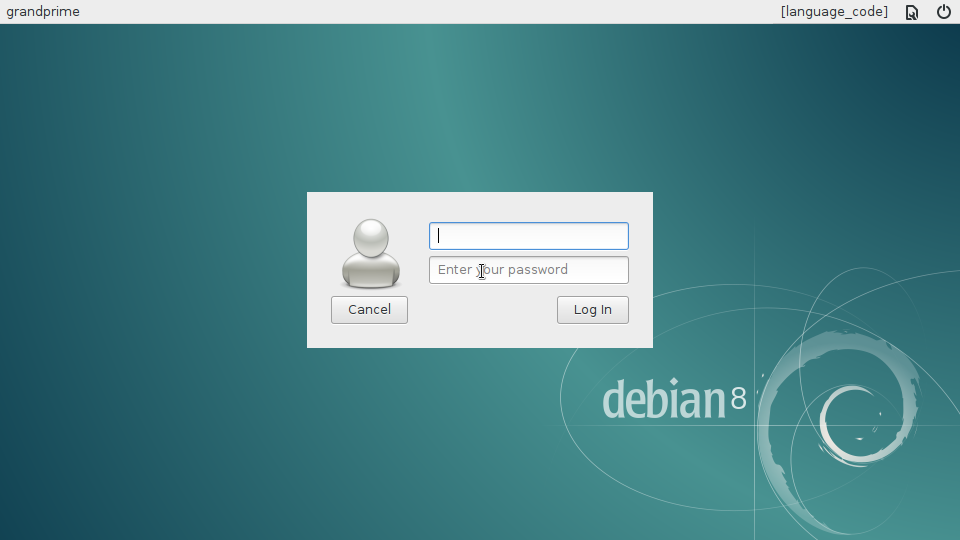
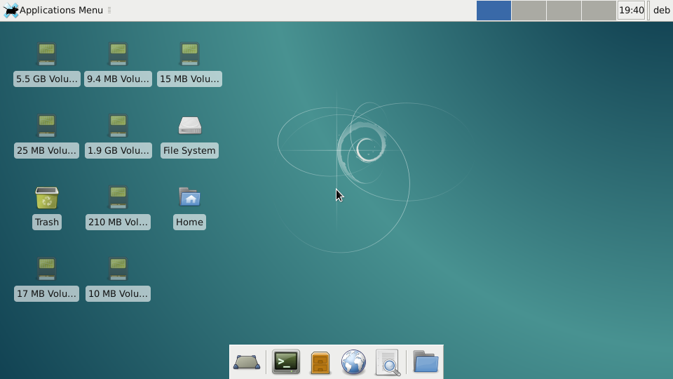

# Linux in the pocket

This project brings bare-metal Linux desktop and services to smartphones.

Plenty of smartphones are sadly lying around, waiting for a second life. Most of them provide enough resources to be recycled as mini computers. With a variety of sensors, cameras, microphones, they are great battery-powered maker devices. As smartphones often support USB OTG, even more peripherals to be added for desktop use. This is only possible with software that allows customization. This repository shows how to build such a system using existing free and open-source software on [supported hardware](doc/Supported_hardware.md). See the [gallery](doc/Gallery.md) for applications.


# Run Debian on your smartphone

## Build from scratch

The Makefile in this repository will take care of the whole build process, from fetching the source to compiling and assembling the system images. Let's start by getting the required files:

```
$ git clone https://github.com/fdu/lip.git
$ cd lip
```

The build process can run natively or from within a Docker container. This is optional but solves the build environment issues. Afterwards, the build instructions themselves are identical. If you wish to build from a Docker container, run:

```
$ docker build -t lip-builder src/docker/lip-builder/
$ docker run -it --rm -v `pwd`:`pwd` lip-builder sh -c "cd `pwd` && bash"
```

Now we are ready to build the system images:

```
$ make
```

Once the build completes, the images are available under *output/*. The [recovery image](doc/Recovery_and_Buildroot.md) *output/sdcard/recovery.img.tar* contains the Linux kernel and device tree blobs. It must be flashed with Odin (tested on the smartphone used as reference with version 3.12.3). In AP, select the *output/sdcard/recovery.img.tar* file then click *Start*.

An archive of the root file system has been created under *output/sdcard/rootfs.tar.gz* with [debootstrap](https://wiki.debian.org/Debootstrap). It contains a base Debian system with a SSH server and minimal device specific configuration. The archive must be extracted at the root of an ext4 formatted SD card.

Insert the SD card into the smartphone, reboot in recovery mode. The following login prompt should be visible:


Congratulations, this is Debian running on your smartphone!

## Take control

With [USB OTG](https://en.wikipedia.org/wiki/USB_On-The-Go) enabled, an USB keyboard can be connected to interact with the login prompt. This implies editing the */etc/shadow* file on the SD card from another machine beforehand, in order to set the root password.

Alternatively, this minimal Debian system run a SSH server. If connected to a USB host, a USB ethernet network adapter is brought up at boot with IP 192.168.234.2. By setting IP 192.168.234.1 on the host, the Debian smartphone answers to ping. Before connecting over SSH, either a user and password must be added in the SD card from another machine, or the public SSH key of the host must be copied to */root/.ssh/authorized_keys*.

```
$ ssh root@192.168.234.2

The programs included with the Debian GNU/Linux system are free software;
the exact distribution terms for each program are described in the
individual files in /usr/share/doc/*/copyright.

Debian GNU/Linux comes with ABSOLUTELY NO WARRANTY, to the extent
permitted by applicable law.
root@grandprime:~#
```

Welcome to Debian on your phone!

By enabling IP forwarding and masquerading on the host, the phone can connect to internet, which will be needed to install more packages.

## Wi-Fi

Wi-Fi requires binary firmware files. They must be extracted over from an original system or a backup and copied to *src/overlay/sdcard/lib/firmware/*. With the smartphone used as reference, those files are:
* mrvl/bt_init_cfg.conf
* mrvl/SDIO8777_SDIO_SDIO.bin
* mrvl/txpwrlimit_cfg.bin
* mrvl/sd8777_uapsta.bin
* mrvl/WlanCalData_ext.conf
* mrvl/bt_cal_data.conf
* mrvl/txbackoff.txt
* mrvl/txpower_FC.bin
* mrvl/reg_alpha2
* ispfw_v325.bin

Add *wpa-ssid* and *wpa-psk* to */etc/network/interfaces* for your network with the interface *wlan0*. Then to bring it up:

```
$ ifup wlan0
```

## Xorg

[Xorg](https://www.x.org) comes with a frame buffer driver with good enough performances for many applications with [Xfce](https://xfce.org/). Let's start by installing it:

```
$ apt update
$ apt install xfce4 lightdm
```

Stride / pitch issues can be fixed with fbset:

```
$ fbset -xres 536 -yres 960
```

The LightDM login screen should be visible:



To rotate it, create the file */etc/X11/xorg.conf* with:

```
Section "Device"  
  Identifier "fb"
  Driver "fbdev"
  Option "fbdev" "/dev/fb0"
  Option "Rotate" "CW"
EndSection
```



To auto-login and start directly to the Xfce desktop, let's add an user:

```
$ adduser deb 
perl: warning: Setting locale failed.
perl: warning: Please check that your locale settings:
	LANGUAGE = (unset),
	LC_ALL = (unset),
	LANG = "fr_FR.UTF-8"
    are supported and installed on your system.
perl: warning: Falling back to the standard locale ("C").
Adding user `deb' ...
Adding new group `deb' (1001) ...
Adding new user `deb' (1001) with group `deb' ...
Creating home directory `/home/deb' ...
Copying files from `/etc/skel' ...
Enter new UNIX password: 
Retype new UNIX password: 
passwd: password updated successfully
Changing the user information for deb
Enter the new value, or press ENTER for the default
	Full Name []: 
	Room Number []: 
	Work Phone []: 
	Home Phone []: 
	Other []: 
Is the information correct? [Y/n]
```

Then set the following in */etc/lightdm/lightdm.conf*:

```
[SeatDefaults]
autologin-user=deb
...
```



# More pages

* [Gallery](doc/Gallery.md)
* [Supported hardware](doc/Supported_hardware.md)
* [Recovery image and Buildroot](doc/Recovery_and_Buildroot.md)
* [Build a RAM-disk only system with Buildroot](doc/Recovery_image_Buildroot_RAM_disk.md)
* [Build TWRP](doc/Build_TWRP.md)
