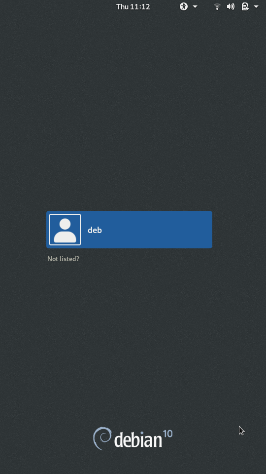
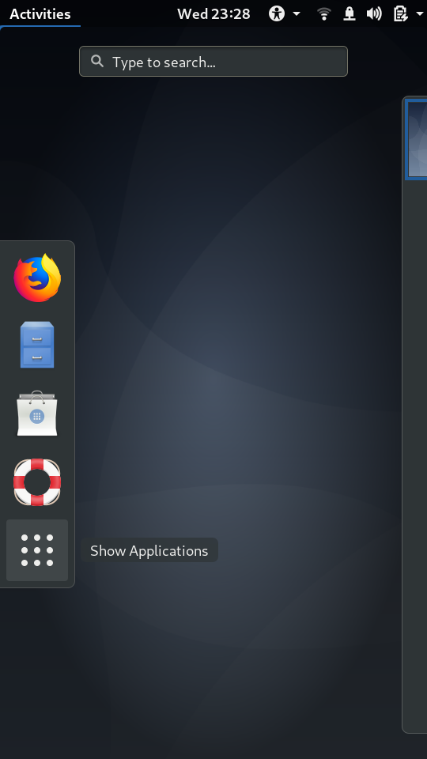
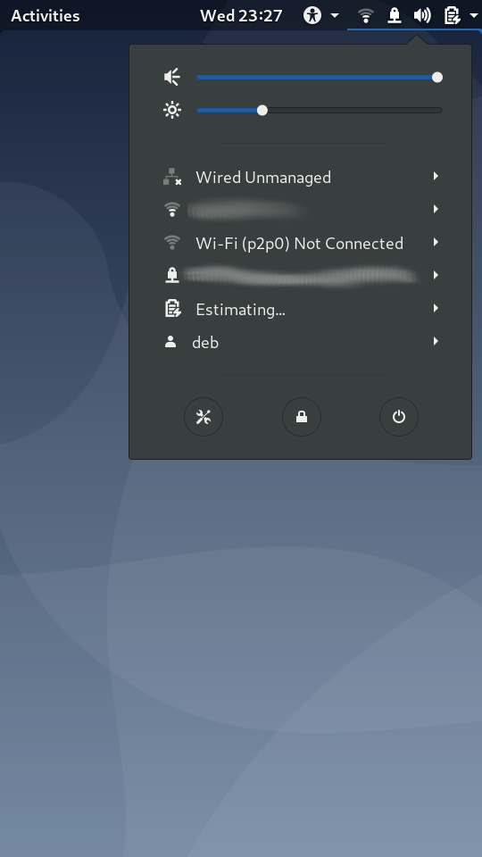
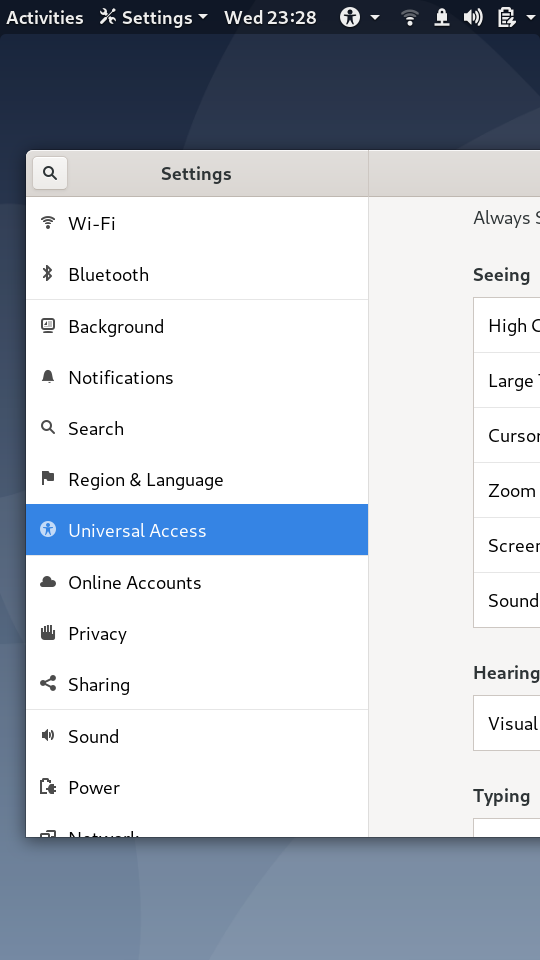
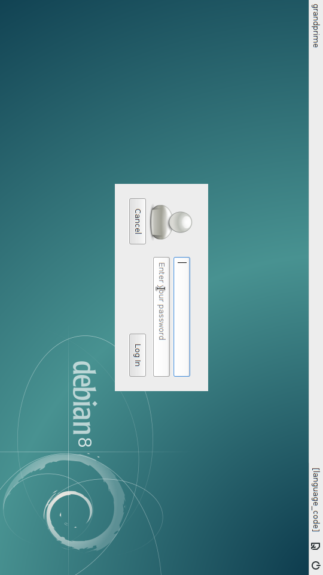

# Gallery

## Console

Debian buster console login

Debian jessie console login

## Gnome desktop (buster)

GDM

Activities

Notifications

Settings

## Xfce4 desktop (buster)

Light DM

Desktop

Telegram

## Xfce4 desktop (jessie)

Desktop

Light DM

Xfce4 desktop

Multitask

VLC

htop

SuperTuxKart

LibreOffice Writer

LibreOffice Calc

## RAM disk

RAM disk boot menu

RAM disk shell with Buildroot

