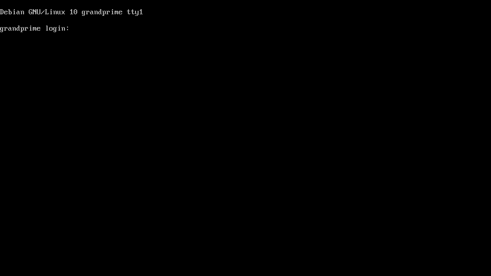
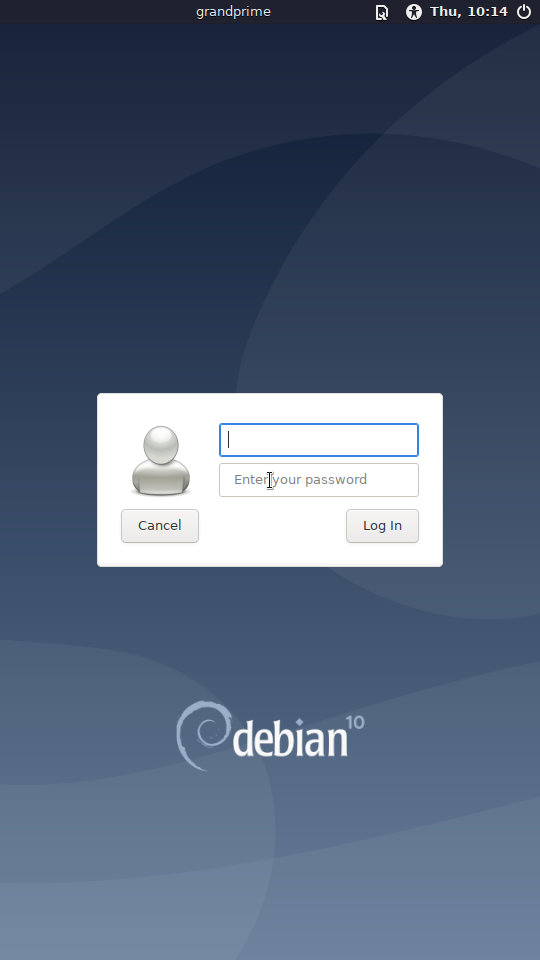
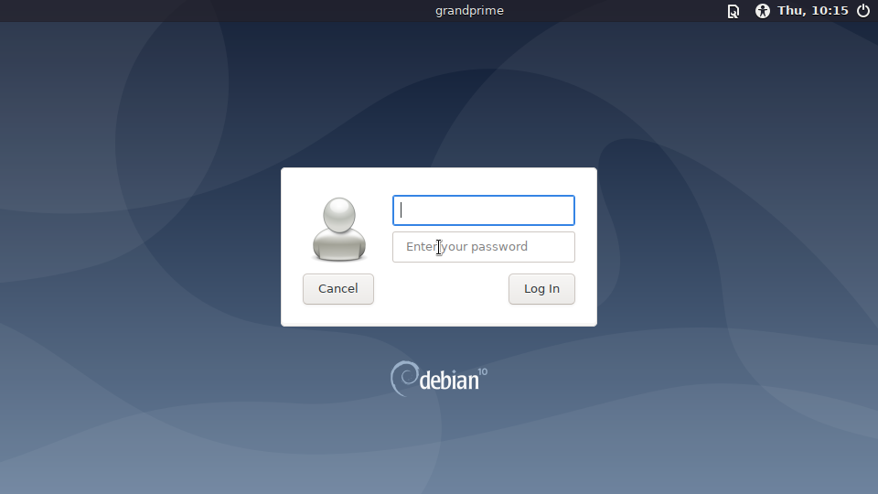
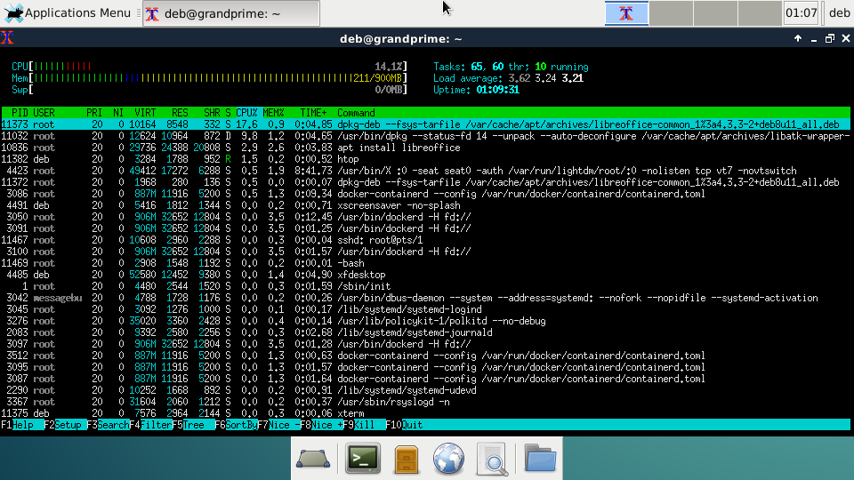
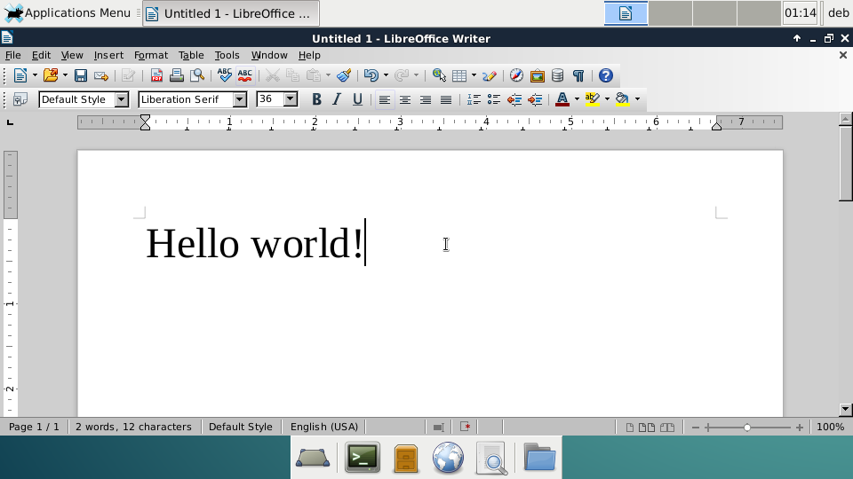
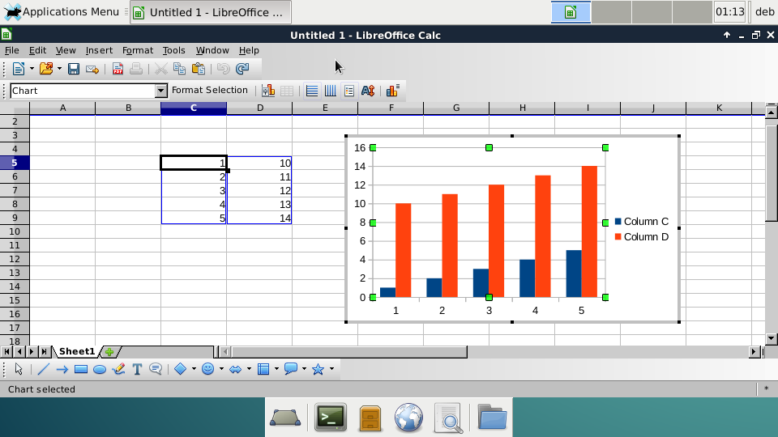

# Gallery

## Console

Debian buster console login

Debian jessie console login

## Desktop (buster)

Light DM

Xfce4 desktop

## Desktop (jessie)

Desktop on smartphone

Light DM

Xfce4 desktop

Multitask

VLC

htop

SuperTuxKart

LibreOffice Writer

LibreOffice Calc

## RAM disk

RAM disk boot menu

RAM disk shell with Buildroot

